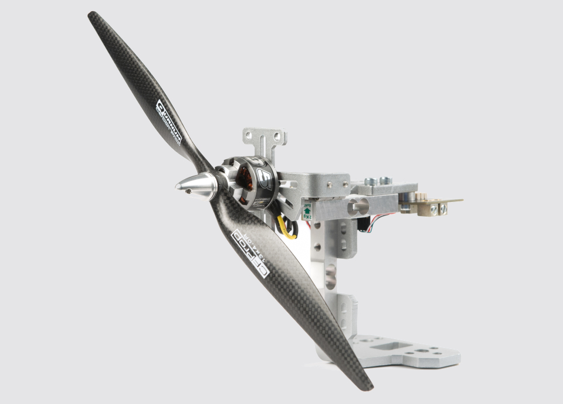
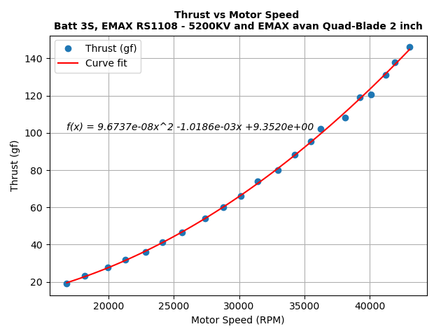
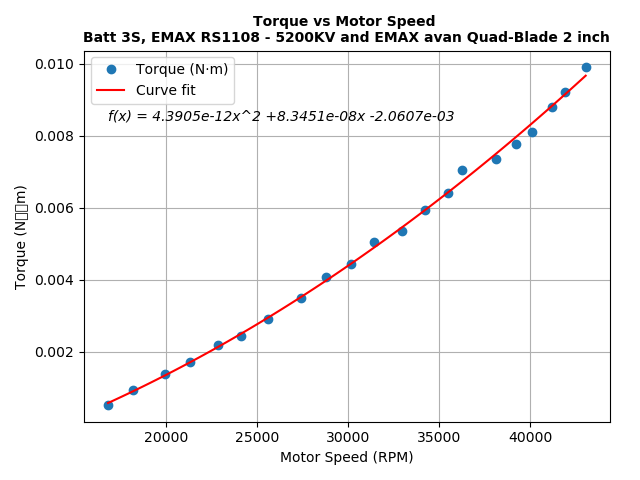
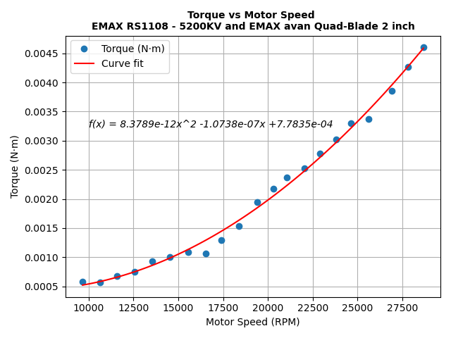
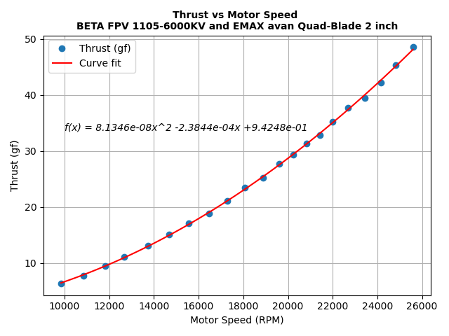

# Thruststant RCbenchmark test

### Test 1
#### Materials

* **Battery** Tattu 650 mAh 3CELLS
* **Motor** EMAX RS1108 - 5200KV 
* **Propeller** "EMAX avan Quad-Blade 2 inch
* **ESC** AKK 20 A 4 en 1 BLHeli 2S–4S

 

### Test 2
#### Materials

* **Battery** Tattu 650 mAh 2CELLS
* **Motor** EMAX RS1108 - 5200KV 
* **Propeller** "EMAX avan Quad-Blade 2 inch
* **ESC** AKK 20 A 4 en 1 BLHeli 2S–4S

 

#### Test 3

* **Battery** Tattu 650 mAh 2CELLS
* **Motor** BETA FPV 1105-6000KV
* **Propeller** "EMAX avan Quad-Blade 2 inch
* **ESC** AKK 20 A 4 en 1 BLHeli 2S–4S

 

#### Test 4

* **Battery** URGENEX 750 mAh 1-cell
* **Motor** BETAFPV 0802SE-23000KV
* **Propeller** "Gemfan Durable Bi-blade 20mm
* **ESC** AGFRC XR-4A
 

#### Test 5

* **Battery** URGENEX 750 mAh 1-cell
* **Motor** BETAFPV 0802SE-23000KV
* **Propeller** "Bi-blade 40mm
* **ESC** AGFRC XR-4A

#### Test 6

* **Battery** URGENEX 750 mAh 1-cell
* **Motor** BETAFPV 1102-22000KV
* **Propeller** "Bi-blade 65mm
* **ESC** AGFRC XR-4A

